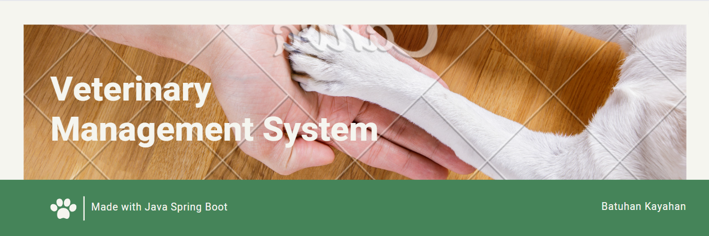
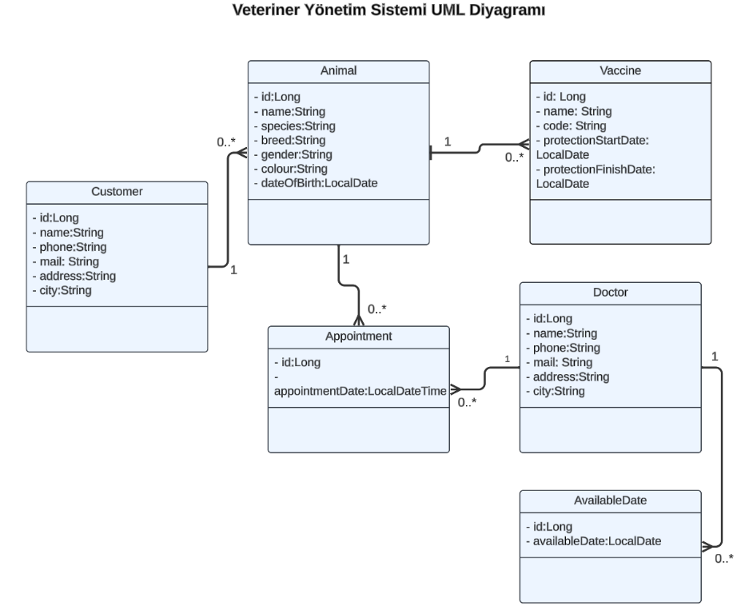
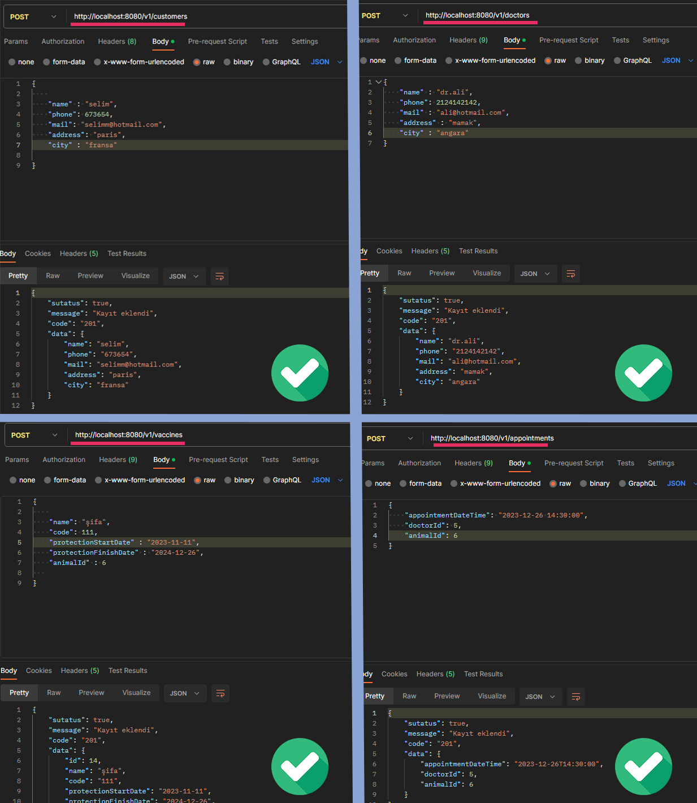

 

Veterinary Management System is a comprehensive software designed
to streamline and enhance various aspects of veterinary practices,
facilitating efficient management of animal healthcare services.
This system integrates multiple functionalities to effectively
handle patient care, appointment scheduling, medical records, 
and administrative tasks within a veterinary clinic or hospital.

## Key Features of the API ⚙️

### Animal and Owner Management🐱
- Saving, updating, viewing, and deleting animals and their owners

### Vaccine Management 💉
- Recording, updating, viewing, and deleting vaccines for animals

### Appointment Management📅
- Handling vaccination and examination appointments for animals

### Veterinarian Doctor Management⚕️
- Saving, updating, viewing, and deleting veterinarian doctors

 

**Sample Crud Processes**

## Technologies Used and Dependencies 🦾

- Spring Web 🌱
- Spring Data JPA 🗄️
- PostgreSQL 🛢

## How to Use?🚀

Steps to run the project can be written here.⚡

## Contact ☎️

If you have any questions or feedback, please contact us at <a href="https://www.linkedin.com/in/batuhankayahan/" target="_self">Here</a>

---

